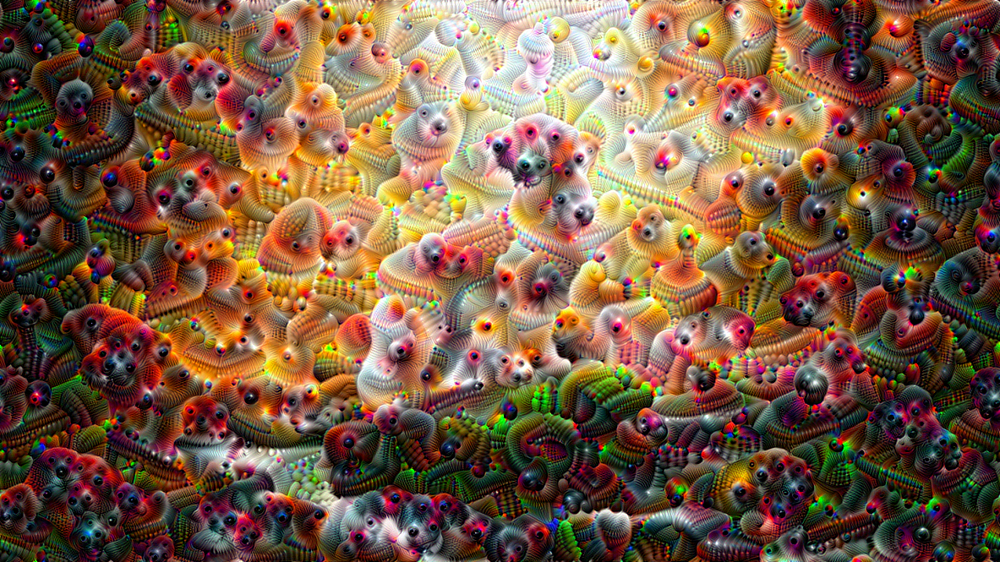

# DeepDream
DeepDream is a project that visualizes and amplifies the patterns learned by a neural network. By enhancing specific features detected by the network, it generates dream-like images that reveal the complex internal structures within a neural network.

## Project Overview
Deep Dream uses the InceptionV3 model pre-trained on ImageNet. This model is designed to detect a wide variety of features in images, and with Deep Dream, we can visualize what those features might look like in exaggerated, surreal forms.

The goal of this project is to explore how neural networks interpret and magnify patterns in images, providing insight into how these models "see" the world.

## Key Features:
 * Neural Network Visualization: Amplifies patterns learned by InceptionV3.
 * Customizable Settings: Control the layers and scales used in the dreaming process.
 * Image Transformation: Produce psychedelic, dream-like visuals from standard images.

### Example
Here's and example of an image generated by the `DeepDream` Model:

